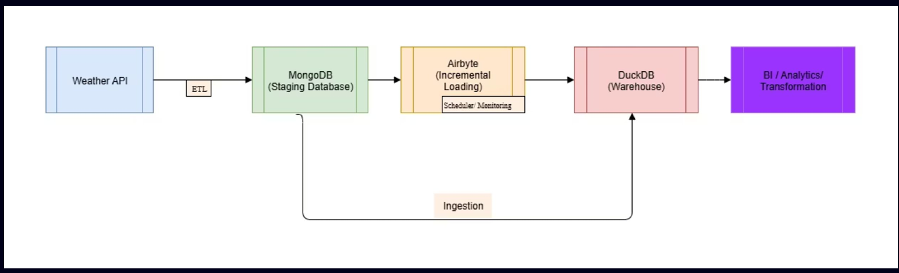
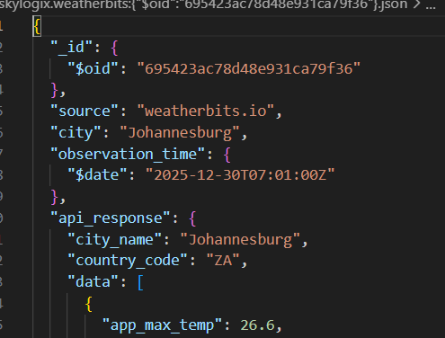

# skylogix Transportation

## Weather Data Ingestion & Analytics Pipeline
### Problem
 ###
### Solution
This project implements an end-to-end data pipeline for ingesting, staging, replicating, and modeling weather API data for analytics and dashboarding use cases.

The pipeline uses MongoDB as a staging database, a Python ingestion service for polling external weather APIs, Airbyte (Docker) for data replication, and DuckDB as the analytical warehouse.

### Python Weather Ingestion Script

The ingestion service:
- Periodically polls one or more weather APIs
- Normalizes API responses
- Performs upserts into MongoDB to avoid duplicates
- Tracks record freshness using an updatedAt timestamp

Key Behaviors
- Idempotent
- Handles updates to existing weather observations
- Designed to be schedulable (cron / Airflow-ready)

### MongoDB Staging Layer
MongoDB acts as a raw but structured staging layer, optimized for:
- Flexible schema evolution from APIs
- Fast upserts
- Reliable CDC-style replication via Airbyte

Document Structure:

- 

### Future Improvements
- Orchestrate ingestion and syncs with Airflow
- Add data quality checks (freshness, nulls, anomalies)
- Partition analytical tables by date
- Extend to multiple weather API providers
- Publish dashboards using Metabase or Superset

#### Author
##### Taofeecoh Adesanu, Data Engineer
